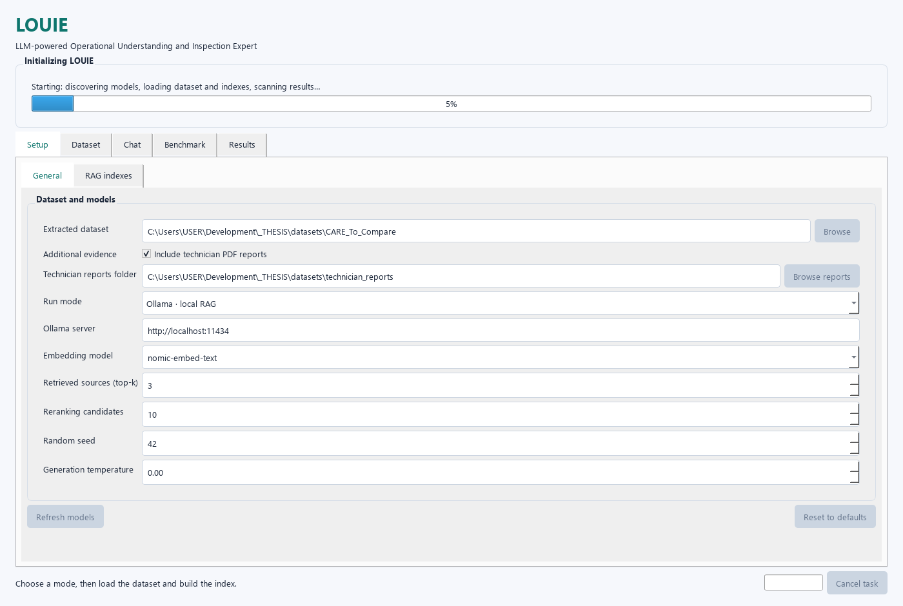
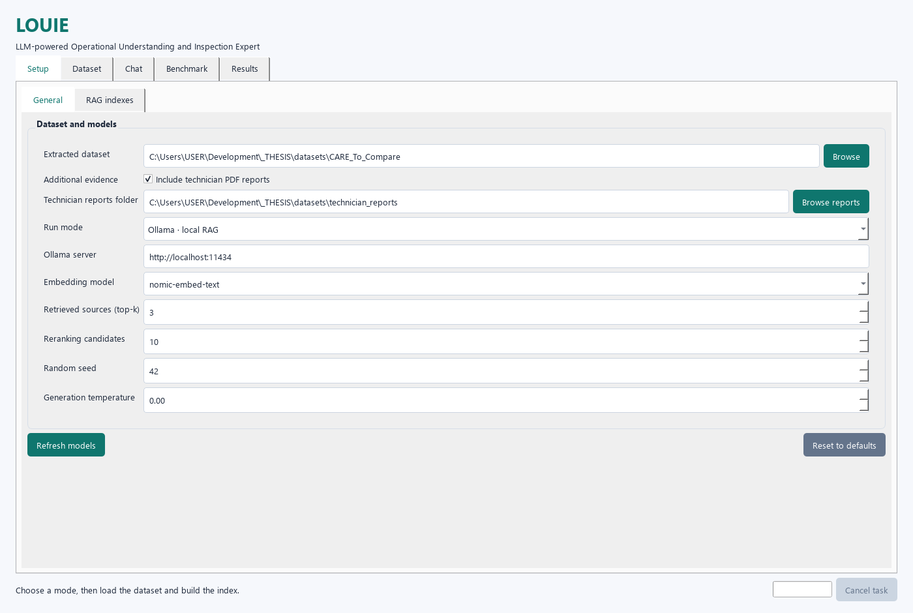
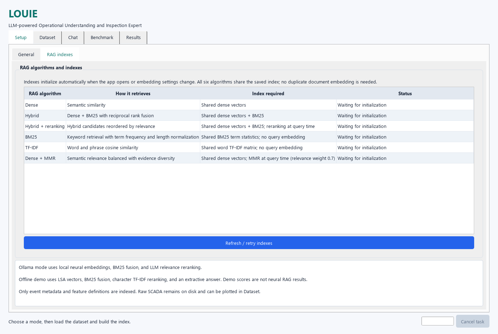
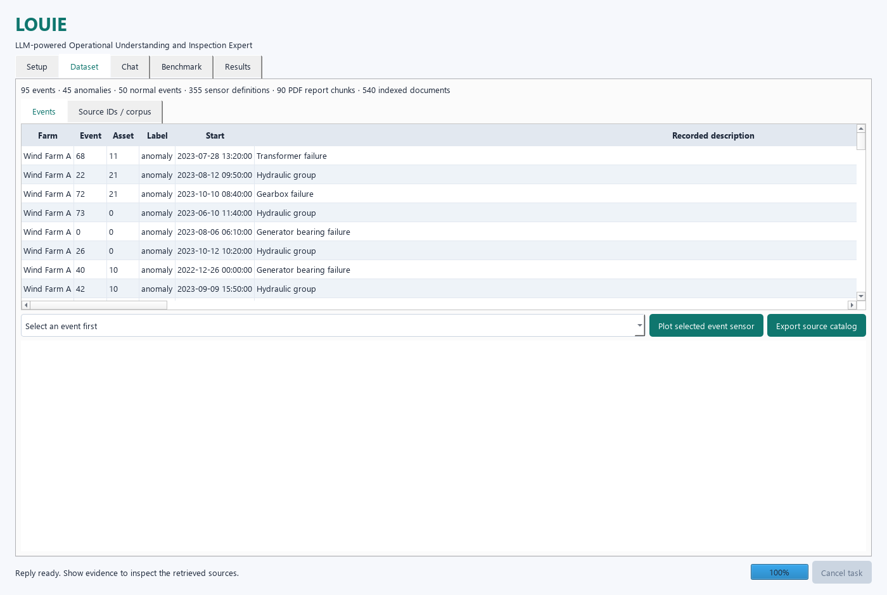
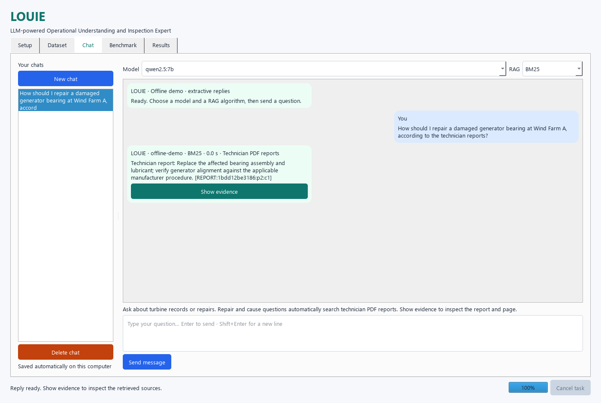
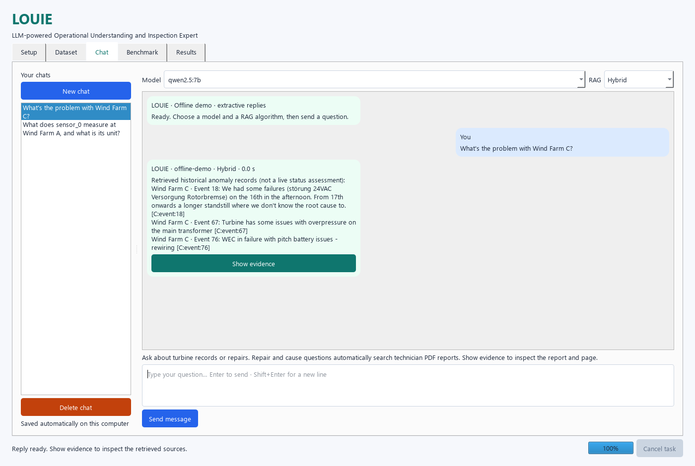
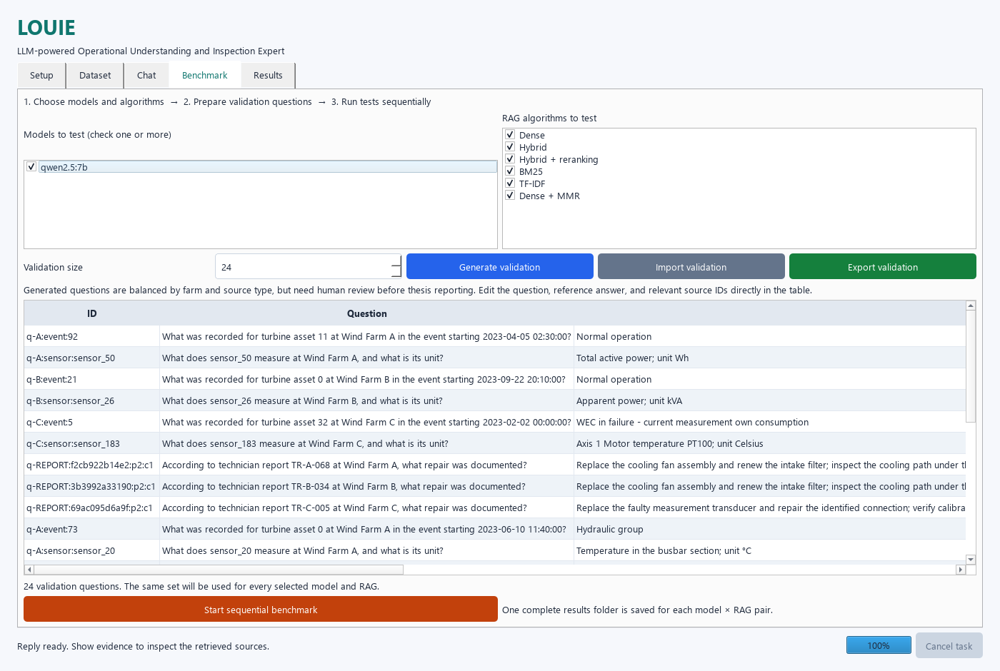
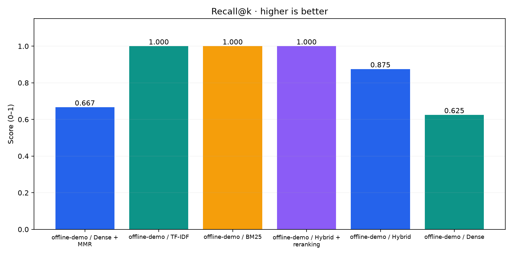
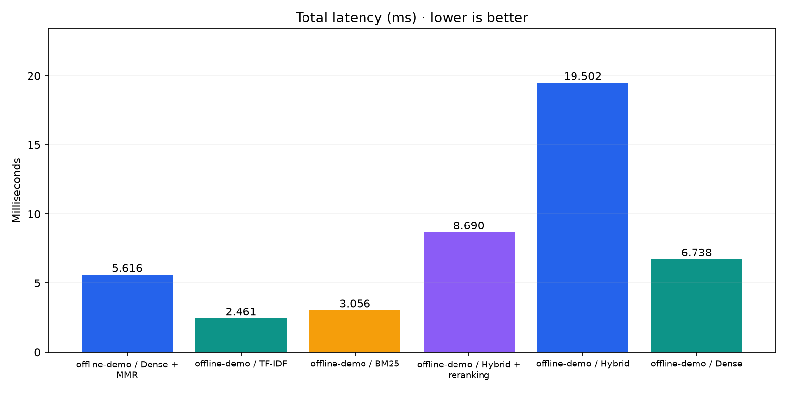
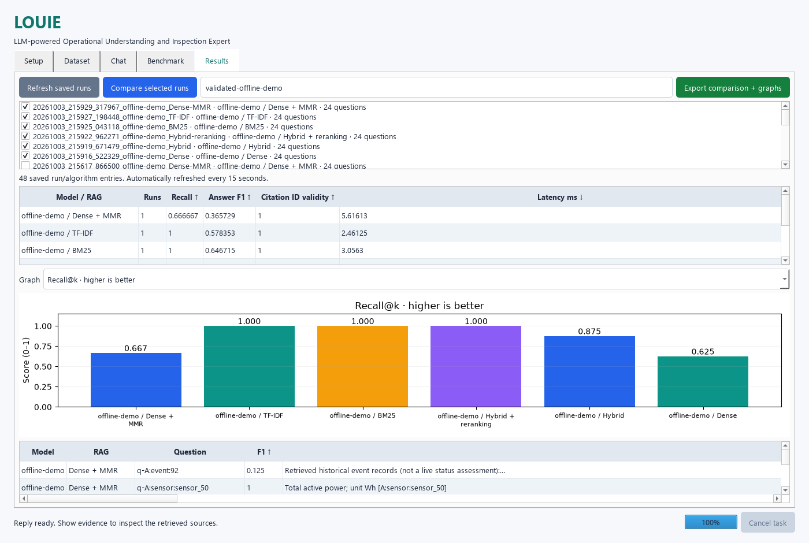

# LOUIE — LLM-powered Operational Understanding and Inspection Expert

Chat with wind turbine records and technician PDF reports, benchmark selected local models and RAG algorithms sequentially, and compare saved experiments.

This is a Windows beginner guide: first install and open the tools, then prepare the data, run LOUIE, and conduct a reproducible comparison. [The technical course](docs/COURSE.md) adds formulas, worked examples, and research methodology. No programming knowledge is required to use the interface.

## Contents

- [What to open and what each tool does](#what-to-open-and-what-each-tool-does)
- [Install from scratch](#install-from-scratch)
- [Run Conda and LOUIE inside VS Code](#run-conda-and-louie-inside-vs-code)
- [Daily startup and shutdown](#daily-startup-and-shutdown)
- [Setup and automatic indexing](#1-setup)
- [Dataset, chat, PDFs, and saved conversations](#2-chat)
- [Benchmark algorithms and models step by step](#3-benchmark)
- [Compare runs and export graphs](#4-results-and-comparisons)
- [Technical concepts and Python libraries](#technical-concepts-and-python-libraries)
- [Algorithms, metrics, and their limits](#algorithms-and-metrics)
- [Troubleshooting](#troubleshooting)

## What to open and what each tool does

| Tool | Purpose | When you open it |
| --- | --- | --- |
| Web browser | Download installers, project, and dataset | Initial setup; viewing GitHub |
| File Explorer | Extract archives and locate files | Dataset setup; opening exported results |
| Anaconda Prompt | A terminal already configured for Conda | Create/activate the environment and launch the app |
| VS Code | Optional editor with an integrated terminal | Work with project files and run the app from one window |
| Ollama | Runs downloaded embedding and answer models locally | Keep running for real LLM experiments |
| LOUIE | The separate desktop window started by Python | Chat, benchmark, and compare |
| PDF viewer | Opens a report when you click Open PDF | Inspecting report evidence |

You do not need Anaconda Navigator or a Jupyter notebook to run LOUIE. VS Code is optional; Anaconda Prompt alone is sufficient. Ollama is a separate application from the Conda environment.

## Install from scratch

### Step 1 — Install the tools

1. Install [Anaconda Distribution](https://www.anaconda.com/download) for Windows, or [Miniconda](https://docs.conda.io/projects/conda/en/latest/user-guide/install/windows.html) for a smaller Conda installation. Use one installation. Reopen terminals after installing.
2. Optionally install [VS Code](https://code.visualstudio.com/). Open its Extensions panel with **Ctrl+Shift+X** and install **Python**, published by Microsoft. This provides Python interpreter selection.
3. For real local models, install [Ollama for Windows](https://ollama.com/download/windows). Offline demo can run without it.
4. If you want to clone/pull the repository using commands, install [Git for Windows](https://git-scm.com/downloads/win). Downloading the repository ZIP does not require Git.

Model downloads and the CARE archive can require substantial disk space. Model response time depends on CPU/GPU and available memory; there is no guaranteed runtime for a particular computer. See [Ollama's Windows requirements](https://docs.ollama.com/windows).

### Step 2 — Get the project

Open [Anch422/wind-rag](https://github.com/Anch422/wind-rag), choose **Code → Download ZIP**, and use File Explorer's **Extract All**. Open the extracted folder containing `app.py`, `requirements.txt`, and this README. The downloaded project archive is different from the dataset archive.

Alternatively, in Anaconda Prompt with Git installed:

```bat
cd /d C:\Users\USER\Development
git clone https://github.com/Anch422/wind-rag.git
cd wind-rag
```

Replace the example folder with your own location. The existing project on this computer is `C:\Users\USER\Development\_THESIS`; a fresh clone might instead be `C:\Users\YourName\Development\wind-rag`. Use your actual project path in every command below.

### Step 3 — Create the named Conda environment

Open **Start → Anaconda Prompt** (or Miniconda Prompt), then run each line and wait for it to finish:

```bat
conda create -n wind-rag python=3.11 pip
conda activate wind-rag
```

If Conda asks whether to proceed, type `y` and press Enter. If `wind-rag` already exists, skip creation and activate it. `-n wind-rag` creates a normal named environment in Conda's environment location, outside the project. Do not create an environment with a project-folder path.

Change into the folder containing `requirements.txt`, then install the app libraries:

```bat
cd /d C:\Users\USER\Development\_THESIS
python -m pip install -r requirements.txt
python -m pip check
python -c "import sys; print(sys.executable)"
```

The last command should show a path containing `envs\wind-rag\python.exe`. `(wind-rag)` in the prompt indicates activation. `python -m pip` installs into the Python you activated. Install once; activate again whenever you open a new terminal. `pip check` should report no broken requirements.

Alternative: `conda env create -f environment.yml` recreates the provided environment including optional notebook tools. Choose either this approach or the minimal creation above; do not create the same environment twice. The minimal app does not need Jupyter, openpyxl, Torch, FAISS, or LangChain.

### Step 4 — Put the CARE data in place

Datasets are excluded from GitHub. Obtain the CARE archive from [Wind Turbine SCADA Data For Early Fault Detection on Zenodo](https://zenodo.org/records/15846963), extract it, and locate the folder containing **Wind Farm A**, **Wind Farm B**, and **Wind Farm C**. Follow the dataset's attribution/license requirements when using or distributing it.

The app expects this structure (additional files are allowed):

```text
your-project/
  app.py
  datasets/
    CARE_To_Compare/
      Wind Farm A/
        event_info.csv
        feature_description.csv
        datasets/
          0.csv
          ...
      Wind Farm B/
        event_info.csv
        feature_description.csv
        datasets/
      Wind Farm C/
        event_info.csv
        feature_description.csv
        datasets/
```

Avoid an extra nested `CARE_To_Compare/CARE_To_Compare/` level. You can leave the data elsewhere and use **Browse** in Setup to choose its parent folder containing the three farms. An archive file itself is not an extracted dataset folder.

The RAG corpus indexes event descriptions and sensor definitions, plus optional reports. It does not embed every raw SCADA reading or automatically diagnose anomalies from time-series data. The Dataset tab can display an event's time series separately.

### Step 5 — Add reports, or disable them

PDFs are also excluded from GitHub. Choose one option:

- Place your searchable technician PDFs in `datasets/technician_reports`, or select another folder with **Browse reports**.
- Recreate the generated research report dataset from CARE using the optional commands below.
- For a CARE-only run, uncheck **Include technician PDF reports** in Setup. A fresh clone with no reports needs this unchecked before initialization can succeed.

To recreate the research reports, from the activated environment in the project folder:

```bat
python -m pip install reportlab
python tools/generate_technician_reports.py
```

`reportlab` is optional and creates PDFs; `pypdf` is already an app dependency and reads them. The generator writes 45 separate two-page PDFs and a provenance manifest under `datasets/technician_reports`. Run it to create this supplied research dataset, not against a folder of your own reports: matching generated filenames are overwritten. Generated diagnoses/repairs are research fixtures rather than independently verified field findings.

### Step 6 — Install local Ollama models

Open **Ollama** from Start. Open a terminal and run:

```bat
ollama pull nomic-embed-text
ollama pull qwen2.5:7b
ollama list
```

`pull` downloads a model; `list` shows installed names. The embedding model turns text into vectors; the answer model writes replies. They perform different jobs. This example matches the app's default answer-model choice. You can select other installed chat models; use a model that fits your hardware.

If Ollama is not running, run `ollama serve` in a separate terminal and leave that terminal open. If it reports the port is already occupied by Ollama, use the existing server rather than starting another. Local requests use `http://localhost:11434`. Downloads need internet; inference uses the local server. See the official [Windows guide](https://docs.ollama.com/windows) and [CLI reference](https://docs.ollama.com/cli).

For a quick workflow check without model downloads, skip this step and choose **Offline demo** in LOUIE. Demo results measure statistical retrieval with extractive answers, not neural LLM performance.

### Step 7 — Launch LOUIE

In Anaconda Prompt:

```bat
conda activate wind-rag
cd /d C:\Users\USER\Development\_THESIS
python app.py
```

A desktop window appears. Keep the launching terminal open while the application runs. Wait for initialization. If a path or model is missing, fix it in Setup and retry; for Offline demo, select that run mode. A successful startup unlocks Chat and Benchmark. You do not need to start a browser server or run `ollama run` for each chat.

## Run Conda and LOUIE inside VS Code

### Select the project and Python

1. Open **VS Code → File → Open Folder** and select the project folder containing `app.py`.
2. Install Microsoft's **Python** extension if you have not done so.
3. Press **Ctrl+Shift+P**, type **Python: Select Interpreter**, and select the Python belonging to **wind-rag**.
4. If it is missing, choose **Enter interpreter path** and select your Conda environment's `python.exe`. On this computer it is `C:\Users\USER\anaconda3\envs\wind-rag\python.exe`; other installations differ.
5. Open **Terminal → New Terminal**. A new terminal may activate the selected environment automatically; verify the Python path rather than relying only on the prompt. Selecting an interpreter and activating an existing terminal are separate actions. See [Microsoft's environment guide](https://code.visualstudio.com/docs/python/environments).

### Activate Conda in the VS Code terminal

If the terminal is **PowerShell**, initialize it once from **Anaconda Prompt**:

```bat
conda init powershell
```

Close and reopen VS Code so new PowerShell terminals load the updated shell configuration. This changes your shell profile, not the project. Conda documents the restart requirement in [conda init](https://docs.conda.io/projects/conda/en/stable/commands/init.html).

Then, in VS Code's PowerShell terminal:

```powershell
conda activate wind-rag
Set-Location 'C:\Users\USER\Development\_THESIS'
python -c "import sys; print(sys.executable)"
python app.py
```

Use your real project path. `cd /d` is for Anaconda Prompt/Command Prompt; PowerShell uses `Set-Location` or `cd` without `/d`. If already in the project, omit the folder-change line.

If PowerShell profile loading is blocked by your computer's policy, use **Anaconda Prompt** instead. Another option is launching VS Code from an activated Anaconda Prompt:

```bat
conda activate wind-rag
cd /d C:\Users\USER\Development\_THESIS
code .
```

Still choose the `wind-rag` interpreter in VS Code. If `code` is unavailable, use File → Open Folder. You can also choose **Terminal → Select Default Profile → Command Prompt**, open a new terminal, and activate Conda if that shell is initialized. Do not weaken system security settings just to run the app.

### Run with the editor's button

Open `app.py`, then choose **Run Python File in Terminal** using the selected `wind-rag` interpreter. The app window opens separately from VS Code. **F5** debugging is optional; the terminal command is the clearest first-run method. Stop by closing LOUIE normally. Do not close its terminal while a benchmark is running unless you intend to terminate it.

## Daily startup and shutdown

1. Open Ollama for real-model mode. Skip it for Offline demo.
2. Open Anaconda Prompt, or VS Code with the project and `wind-rag` interpreter.
3. Activate `wind-rag`, enter the project directory, and run `python app.py`.
4. Wait for automatic initialization. Saved compatible indexes load; the last selected chat returns.
5. Use Chat for exploration, Benchmark for experiments, and Results for comparisons.
6. Close LOUIE when done. Messages and drafts save locally. `conda deactivate` is optional after the app closes.

Do not recreate the environment, reinstall libraries, pull unchanged models, or rebuild the same index each day. To update a Git clone, close the app and run `git pull` in its folder; reinstall requirements only when dependencies change. Local data, sessions, and results remain excluded from Git.

## 1. Setup

Choose the extracted `datasets/CARE_To_Compare` folder and an embedding model. Ollama models are discovered automatically; **Refresh models** updates the lists.

**Include technician PDF reports** is enabled by default, with the separate folder `datasets/technician_reports`. Use **Browse reports** to select another reports folder, or uncheck the option for CARE-only experiments. Report changes automatically load a matching index. The original CARE files stay unchanged.

Opening the app starts **Initializing LOUIE** automatically. The progress bar covers model discovery, dataset loading, saved-index loading or building, and scanning saved results. Wait for initialization to finish; the app then unlocks Chat and Benchmark. You do not need to click a preparation button. The first embedding build can take longer than loading a saved index.



Setup has two sub-tabs: **General** for dataset/model settings and **RAG indexes** for readiness and index details. The table explains what each algorithm does and which index it needs. The 450 source documents cover 95 events and 355 sensor definitions. Smaller windows provide scrolling so controls remain readable. **Reset to defaults** is in General. **Refresh / retry indexes** is an optional manual refresh, useful after changing metadata files on disk.

The app prepares dense vectors, BM25 term statistics, word TF-IDF, and character TF-IDF together, and saves them in `.cache/indexes/`. All six algorithms share these compatible index components. Switching algorithms or answer models does **not** embed the documents again. MMR and reranking operate at question time and need no separate index. Saved indexes are loaded automatically on each restart. Enabling reports changes the corpus, so the first combined index needs building; later openings reuse it. The former CARE-only cache remains available.

Answer models, top-k, candidates, temperature, and run seed can change without rebuilding. Changed dataset metadata, embedding models, server, or run mode require a matching index. If one exists, it is loaded; otherwise the app builds and saves it. Changing the dataset folder, mode, or embedding setup schedules automatic initialization after a short pause; finish text-field edits by pressing Tab or clicking another control. Dataset contents are also checked before chat or benchmarking, so changed metadata cannot silently use an old index.

**Reset to defaults** restores the standard dataset path, Ollama mode, localhost server, nomic embedding model, top-k 3, candidate pool 10, seed 42, temperature 0, and validation size 24. It selects the installed qwen2.5:7b answer model when available, otherwise the first available model. The original three algorithms are checked by default; the added algorithms are optional. Saved indexes, results, and validation questions are kept. A matching index is prepared automatically if these settings changed.

If initialization fails, the error stays visible and Setup becomes available. Start Ollama or correct the model/path, then use **Retry initialization**. Alternatively, choose **Offline demo**; its index initializes automatically without Ollama. Errors never silently switch your research run to another mode.

For a first trial, choose **Offline demo**. It uses statistical retrieval and extractive replies, not a real language model. Celsius/degree symbols are repaired in the indexed metadata without changing original dataset files.





## 2. Chat

### Inspect the dataset before asking questions

Open **Dataset → Events**. Farm is the site; Event is the recorded window ID; Asset identifies the turbine; Label distinguishes anomaly and normal records; Start and Recorded description summarize the window. Click a column heading to sort, then click again to reverse it. Scroll horizontally when columns extend beyond the window.

Select an event row, choose an available sensor in the dropdown, and click **Plot selected event sensor** to inspect its time series. This reads that event's raw CSV for plotting; it does not update an anomaly diagnosis or add those measurements to the RAG corpus automatically. Missing raw CSVs can prevent plotting while metadata chat remains available.

Open **Source IDs / corpus** to inspect indexed documents and their source IDs. **Export source catalog** saves the evidence catalog for preparing validation annotations. The IDs must match the current corpus; report IDs contain page/chunk identifiers, not just a PDF filename. Selecting an event in Dataset does not silently scope a chat: name the farm/event in your message.

Choose **one model** and **one RAG algorithm**, type a question, and press **Enter** or click **Send message**. **Shift+Enter** adds a new line. An animated typing indicator appears while the reply loads. Your message appears on the right; the reply appears on the left. Only the selected algorithm runs. **Show evidence** expands the retrieved records.

In **Dataset**, click a column title to sort the records; click again to reverse the order. The **Results** tab lets you view saved runs and compare selected runs.



Try: `What does sensor_0 measure at Wind Farm A, and what is its unit?`

### Technician reports and repair questions

The report dataset contains **45 separate searchable PDFs, one report per file, 90 pages total**, covering every recorded CARE anomaly. Each report has an inspection page and a repair/verification page, with varied 2023-2024 service dates, six companies and twelve technicians. It records the affected component, inspection findings, a possible cause, a repair record, parts/materials, verification, and limitations. Filenames include service date, farm, event and report ID. `manifest.json` maps each file to its event and PDF pages.

Generation history and verification status are retained in `manifest.json`, outside the indexed PDF text. These generated research records are not independently verified CARE field-service evidence. Their creation does not establish what actually caused or repaired a CARE anomaly.

Ask, for example:

- `How should I repair generator bearing damage at Wind Farm A, according to the technician reports?`
- `What possible cause was documented in technician report TR-A-040?`
- `What repair was documented for a faulty pitch-motor fan at Wind Farm C?`

Repair, fix, replacement, maintenance, cause, and technician-report questions automatically search **report evidence only**. An explicit farm narrows that report search. Problem/anomaly questions use event evidence; other questions use the appropriate shared intent scope described below. Each selected algorithm ranks the same eligible report evidence using its own retrieval method. The reply shows **Technician PDF reports**, and **Show evidence** displays report ID, PDF page, chunk citation and source file. If matching reports are unavailable, the app reports insufficient evidence rather than inventing a repair from metadata.

Ollama is instructed to ground recommendations in the retrieved repair records, keep possible causes uncertain, and describe the documented action directly without unrelated dataset commentary. The prompt asks it to request the component/event/symptom if the repair question is too vague. Offline demo extracts the top report section; it does not perform generative reasoning. Evaluate responses yourself before drawing research conclusions.



Under **Show evidence**, PDF sources include an **Open PDF** link. Click it to open the report in your default Windows PDF viewer. The evidence title shows the cited page; missing or moved files display a clear message.

To add your own technician reports, place searchable `.pdf` files in a separate folder and choose it in Setup. Subfolders are scanned recursively. Text is extracted with `pypdf`; long pages become overlapping 300-word chunks with 50-word overlap. Citations preserve file and page. Scanned PDFs without searchable text need OCR first; encrypted or unreadable PDFs produce a clear initialization error. Unchanged PDF text is cached in memory to avoid reparsing it for every chat request. Use **Refresh / retry indexes** after editing files on disk.

### Files excluded from GitHub

Datasets, generated benchmark questions/results, saved chat sessions, indexes, temporary files, environments, and credentials are excluded by `.gitignore`. A fresh clone therefore needs the CARE dataset extracted into `datasets/CARE_To_Compare` (or selected in Setup). Provide searchable technician PDFs separately, or disable **Include technician PDF reports**. To regenerate the provided research reports after supplying CARE, install `reportlab` and run `python tools/generate_technician_reports.py`. The source code, tests, documentation, and small guide screenshots are included.

### How questions select evidence

Questions such as **“What's the problem with Wind Farm C?”**, **“What is wrong with Farm C?”**, or **“List anomalies at Wind Farm C”** search recorded anomaly events rather than sensor descriptions. Normal-event requests search normal records; broad health/status questions search event records of both labels. Naming farms restricts retrieval to those farms, including comparisons such as “farms A and C”. Explicit event IDs and turbine/asset numbers further restrict the evidence. Repair, troubleshooting, and possible-cause questions search technician reports. Sensor and unit questions retain general retrieval.

Answers summarize the selected historical records; they do not establish current turbine status or guarantee a complete anomaly inventory. This shared question routing is applied equally to all six retrieval algorithms, so benchmarking still compares their ranking methods. Unrecognized wording uses general retrieval; routing is deterministic and cannot understand every possible phrasing. Include farm, event, component, and dates in your question when relevant. Dates currently help ranking rather than acting as strict date filters.

### Saved chats

The **Your chats** sidebar on the left works like a chat history:

1. Click **New chat** to start a separate conversation.
2. Send a question. The first question becomes the chat's title.
3. Click a chat in the sidebar to return to it.
4. Close and reopen LOUIE: your last selected chat opens automatically after initialization.
5. Click **Delete chat** to permanently remove the selected conversation. Other chats and benchmark results are kept. Deleting the last chat creates an empty chat.

Messages and replies save immediately. Retrieved evidence, PDF links, model/RAG selections, and unsent drafts are also saved automatically. Drafts save shortly after typing and when switching chats or closing the app. Chats are stored locally in `sessions/chat_history.sqlite3`; keep this file if you back up or move your project. They do not require an online account. PDF links refer to the original files, so those files must remain available to open them.

Each request answers the current question independently; include the sensor/farm/event explicitly in follow-up questions. Saved history lets you revisit conversations, but previous messages are not added to the model's question automatically. Chat is separate from benchmark experiments and does not automatically create a results folder.



## 3. Benchmark

### What benchmarking means

A benchmark asks the same reviewed questions under different configurations and measures evidence retrieval, answer overlap, citations, and response time. A **run** is one answer model paired with one RAG algorithm, evaluated on the entire question set. Chat replies do not become benchmark questions automatically.

Keep the **answer model** fixed to compare retrieval algorithms. Keep the **RAG algorithm** fixed to compare answer models. Selecting multiple of both produces a matrix; interpret both factors rather than calling every difference an algorithm effect. In **Hybrid + reranking**, the selected answer model also scores candidate relevance, so changing that model changes both reranking and answer generation.

### First practice experiment: all six algorithms

1. Finish Setup initialization. For a quick interface check, choose **Offline demo**; for an actual LLM experiment, choose **Ollama** and installed models.
2. In Setup, keep one embedding model and the same dataset/report selection. Start with **top-k = 3**, **Reranking candidates = 10**, **seed = 42**, and **temperature = 0**. Their meanings are explained below.
3. Open **Benchmark**. Check one answer model in **Models to test**. In Offline demo, the model selector does not run that model: output folders are labelled `offline-demo`.
4. Check **Dense**, **Hybrid**, **Hybrid + reranking**, **BM25**, **TF-IDF**, and **Dense + MMR**. Only the original three are selected by default; scroll the algorithm list to see all six.
5. Set **Validation size** to **24** and click **Generate validation**. This generates up to 24 questions from the available content; it does not ask the LLM to invent answers.
6. Double-click cells to review/edit the questions, reference answers, and relevant source IDs. Verify the original CSV/PDF, not just another model's answer. Keep all equally valid relevant sources annotated where feasible.
   Use the table's horizontal scrollbar to reach all columns; long questions/reference answers extend beyond the initial view.
7. Click **Export validation** and save the reviewed set, for example as `benchmarks/reviewed-validation.json`. Reimport this exact set for repeat experiments.
8. Click **Start sequential benchmark**. Leave the app and Ollama running. Watch the status for the current model, algorithm, and question.
9. When complete, open **Results**. Select the six newly created compatible runs, click **Compare selected runs**, and inspect recall, answer F1, citations, and latency.
10. Name the comparison, for example `one-model-six-rags`, and click **Export comparison + graphs**. Open its folder in File Explorer to inspect the CSVs and PNG graphs.

One model × six algorithms × 24 questions produces **six run folders and 144 answers**. Hybrid reranking additionally makes relevance-scoring requests. Two answer models with the same selection produce twelve folders and 288 answers. This is why a benchmark takes much longer than a single chat question. Fewer questions are useful for a smoke test; a thesis benchmark needs reviewed coverage appropriate to your claims.

### Choose a comparison that answers your research question

| Experiment | Keep fixed | Change | What it tests |
| --- | --- | --- | --- |
| Retrieval comparison | Answer model, embeddings, corpus, questions, top-k, candidate count, temperature | The six RAG algorithms | Effect of retrieval/ranking under that configuration |
| Answer-model comparison | One RAG, embedding model, corpus, questions, retrieval settings | Selected local answer models | Answer-model quality and latency; with reranking, also model-based ranking |
| Full matrix | Corpus, questions, embeddings, generation and retrieval settings | Models × RAGs | Whether algorithm behavior differs between models |
| Repeatability check | Entire configuration and reviewed question set | Repeat the run | Variation in output and timing |

Separate offline demonstrations from Ollama research results. A different corpus, embedding model, top-k, candidate count, temperature, or prompt version forms a different experiment group: Results will reject combining incompatible runs.

### Make validation suitable for research

Each question has a unique **ID**, a **question**, a **reference answer**, a list of **relevant source IDs**, and an **origin** describing how it was prepared. Relevant IDs are the expected evidence, not the sources one algorithm happened to retrieve. Examples include `C:event:55`, `A:sensor:sensor_0`, and page/chunk IDs beginning `REPORT:`. See Dataset and chat evidence for actual IDs.

Generated validation samples farms and source types. Add reviewed paraphrases, precise event/asset questions, repair/cause questions, and unanswerable cases for the scope of your study. Broad “what problems exist?” questions may have many relevant records; annotate that carefully and remember top-k only supplies a subset. Every question is independent: avoid “What about it?” references to earlier questions. Keep report-derived questions separate in your analysis from independent operational questions if you make claims about real maintenance performance.

The seed controls deterministic validation sampling and reproducible operations where supported. Temperature 0 reduces answer variation but does not guarantee identical outputs across hardware, model versions, or runs. Match model tags and record hardware and model versions in your research notes. Repeated runs help assess timing variation; cold model loading is included in measured requests and can affect the first questions.

### Benchmark controls in order

1. Check which models to test.
2. Check which RAG algorithms to test.
3. Choose a validation size and click **Generate validation**, or import JSON/CSV questions.
4. Review questions, reference answers, and relevant source IDs. Double-click cells to edit.
5. Export validation if you want a standalone copy.
6. Click **Start sequential benchmark**.

Two models and three algorithms produce **six separate runs**, executed one at a time. Each uses the same validation set and index. Completed runs remain saved if a later run fails or testing is cancelled. No benchmark answer reuse occurs across algorithms.

**Force cancel benchmark** stops the isolated benchmark process immediately, including an active model request. It does not wait for the model's response or timeout. Fully exported runs remain saved; the current incomplete run is discarded. The app becomes available again after the process stops. Index preparation and chat retain their usual cancellation behavior.

If a model request fails, its error and validation questions are saved in a folder ending `_failed`, and testing continues with the next selection. Failed runs have no successful metrics and are excluded from comparisons. Successful benchmark exports are prepared under `results/.in_progress/` and moved into the normal results folder only after every file and graph is ready. Results scanning ignores in-progress folders.

Generated questions are balanced across farms and event/sensor/report types. When reports are enabled, the set includes repair and possible-cause questions with page-level references. They are derived from indexed content and **need human review before thesis reporting**. Scores on generated reports do not establish performance on independent real operational or maintenance questions.

Validation size controls generation size. Every displayed imported question runs. Relevant source IDs in the editable table use JSON lists:

```json
[
  {
    "id": "sensor-a-001",
    "question": "What does sensor_0 measure at Wind Farm A, and what is its unit?",
    "reference_answer": "Ambient temperature; unit °C",
    "relevant_ids": ["A:sensor:sensor_0"],
    "origin": "written and reviewed by researcher"
  }
]
```

Unknown source IDs and duplicate question IDs are rejected. Unanswerable questions can use `[]` and a reference of `Insufficient evidence.`. Export questions before changing the corpus, which clears the current validation set.



### Fresh demonstration graphs

The screenshots and graphs below were regenerated using **Offline demo**, all **six RAGs**, and **24 generated questions** against the current combined CARE/report corpus. These verify the workflow; the questions were not independently reviewed, and the results are not a real-model ranking or a thesis finding. Local run/comparison folders remain excluded from GitHub.



Recall asks whether annotated evidence was found. Equal recall can occur even when algorithms rank sources differently. Compare MRR/nDCG and per-question evidence as well.



Offline latency excludes neural inference because no LLM is running. Real Ollama latency includes model requests, and reranking adds another request. Do not extrapolate demo timing to your GPU or CPU.

## 4. Results and comparisons

The app scans `results/` automatically on startup and every 15 seconds while idle. **Refresh saved runs** scans immediately.

1. Check the runs to compare.
2. Click **Compare selected runs**.
3. Select a graph metric and inspect the summary and replies.
4. Enter a comparison export name.
5. Click **Export comparison + graphs**.

Runs must have matching validation questions, corpus, embedding model, run mode, top-k, candidate count, temperature, and prompt version. Different answer models and algorithms can be compared. This prevents misleading averages across different experiments.

The report feature changes the answer prompt version and corpus. Start fresh benchmark runs for comparisons with reports; earlier CARE-only results are preserved and should be compared within their own compatible group.

Repeated runs are averaged per question first, then across questions. This is a descriptive comparison, not an automatic significance test. Unreadable files are skipped and counted. Old results and original data are preserved.



## Saved files

Each complete model/RAG test is named with Asia/Taipei date/time, LLM, and RAG. Microseconds prevent collisions. Characters unsuitable for folder names are replaced with hyphens.

```text
results/
  20261003_193000_123456_qwen2-5-7b_Hybrid/
    run.json
    results.csv
    summary.csv
    validation.json
    validation.csv
    corpus.json
    report.md
    graphs/
      recall_at_k.png
      precision_at_k.png
      mrr.png
      ndcg_at_k.png
      answer_f1.png
      exact_match.png
      citation_validity.png
      citation_recall.png
      total_ms.png
      retrieval_ms.png
      generation_ms.png
      quality_vs_latency.png
      per_question_metrics.png
  comparisons/
    20261003_194000_123456_my-comparison/
      comparison.json
      validation.json
      source_runs/              # Complete original run snapshots
      summary.csv
      results.csv
      report.md
      graphs/
```

`run.json` saves settings, outputs, metrics, evidence, reference answers, hashes, and package versions. Validation files preserve the exact questions. CSV evidence fields are JSON text. Each comparison records the source runs and exports all metric graphs and a quality-versus-latency plot.

The new PDF dataset lives separately:

```text
datasets/technician_reports/
  2023-01-27_Wind_Farm_A_Event_040_TR-A-040.pdf
  ...                                    # 45 separate two-page reports
  manifest.json
  README.md
```

The reproducible generator is `tools/generate_technician_reports.py`. Running it requires `reportlab` and `pandas`; the app itself needs only `pypdf` for PDF reading, included in `requirements.txt`. Install `reportlab` separately only if you want to regenerate the fixtures. The former farm-level compilations have been replaced by individual files. This changes source IDs and the prompt version; generate fresh benchmark results for compatible comparisons.

## Technical concepts and Python libraries

### Python, Conda, and package installation

**Python** is the language running this application. The **interpreter** is the `python.exe` that executes `.py` files. `app.py` is the entry point, which opens the desktop UI. A **terminal** is where you type commands; its **shell** (PowerShell or Command Prompt) determines command syntax. The **working directory** is the folder commands run from. It must contain `app.py` when you type `python app.py`.

**Conda** manages Python versions and environments. An **environment** is a separate toolbox of Python and libraries. `base` is the main installation; `wind-rag` is this project's toolbox. **Activate** changes the toolbox used by the current terminal. It does not move the project or install packages. **pip** installs Python packages; `requirements.txt` lists the app's dependencies, while `environment.yml` describes a fuller Conda environment. They do not contain the datasets or downloaded LLM weights.

| Library | Role in LOUIE | Beginner explanation |
| --- | --- | --- |
| PyQt6 | Desktop widgets, signals, worker threads | Creates buttons, tabs, lists, and the chat window |
| NumPy | Vectors and array calculations | Handles numerical data efficiently |
| pandas | CSV tables and exported results | Organizes rows and columns |
| scikit-learn | TF-IDF, LSA, normalization | Provides statistical text-retrieval tools |
| Matplotlib | Charts and graph files | Draws the comparisons |
| requests | Ollama HTTP calls | Sends model requests to the local server |
| joblib | Saved index serialization and worker payloads | Stores reusable computed objects |
| pypdf | Searchable PDF text extraction | Reads report text; it does not perform OCR |
| reportlab (optional) | Research PDF generator | Writes report PDFs; not needed to use existing reports |
| SQLite (`sqlite3`, built into Python) | Persistent chat history | Saves conversations in one local database file |
| Standard Python libraries | Paths, JSON, timestamps, subprocesses | Built-in tools requiring no separate install |

The optional environment file includes notebook/spreadsheet tools; the core app uses `requirements.txt`. A dependency may install its own dependencies automatically. Installing an Ollama model with `ollama pull` is separate from installing a Python package with pip.

### LLM, embeddings, and RAG

An **LLM** (large language model) generates text. Its downloaded **weights** are learned numerical parameters; its model name/tag selects which version Ollama loads. A parameter count such as `7b` describes billions of parameters, not guaranteed accuracy. A **token** is a piece of text processed by a model; it is not necessarily a whole word.

**RAG** means retrieval-augmented generation. For example, “What's the problem with Wind Farm C?” is routed to its event records, an algorithm ranks those records, the top sources are supplied to the answer model, and the model writes an answer with source IDs. RAG consults your data at question time. It does not retrain the LLM, establish live equipment status, or guarantee that every claim is correct.

```text
CSV metadata + optional PDF text
  → documents/chunks with source IDs
  → shared saved index

Question
  → shared intent/farm/event/asset filtering
  → selected retrieval algorithm
  → up to top-k evidence sources
  → answer model (or offline extraction)
  → reply, citations, timing

Reviewed question + reference answer + relevant IDs
  → benchmark the model × RAG combinations
  → metrics, saved runs, graphs, comparisons
```

An **embedding** represents text as a numerical vector. Dense retrieval compares question/document vectors using **cosine similarity**, which measures their direction. **Lexical retrieval** compares actual words; **semantic retrieval** aims to find similar meaning. Similarity scores are rankings, not percentages of truth. BM25, TF-IDF, cosine, fusion, reranking, and MMR use different score scales, so do not compare their raw evidence scores directly.

### Corpus, chunk, index, cache, and context

The **corpus** is the collection of searchable source documents. CARE creates one document per event and sensor definition. PDFs are split into page-aware **chunks** of up to 300 words with 50-word overlap. A **source ID** identifies evidence, and a **citation** refers to that ID in an answer.

The **index** stores vectors and word statistics so questions can search efficiently. A **cache** is the saved reusable index in `.cache/indexes`; it avoids recomputing compatible document embeddings. The **context** is the retrieved text sent with a question, not the whole dataset. Top-k limits that text, so a broad farm summary may omit records even if the full corpus contains them.

**LSA** (latent semantic analysis) reduces TF-IDF into statistical vectors in Offline demo. It is a substitute for testing the workflow, not the same embedding model used by Ollama. **OCR** (optical character recognition) converts scanned page images to text; you must perform it separately before importing image-only PDFs.

### Settings you will see

| Setting | Default in the interface | What it changes |
| --- | --- | --- |
| Run mode | Ollama | Real local inference versus statistical offline demo |
| Ollama server | `http://localhost:11434` | Local service address; `localhost` means this computer |
| Embedding model | `nomic-embed-text` when available | Document/question vectors; changing it needs a matching index |
| Retrieved sources (top-k) | 3 | Maximum evidence sources supplied for one question |
| Reranking candidates | 10 | Candidate pool for hybrid retrieval/reranking and MMR; at least top-k |
| Random seed | 42 | Repeatable sampling and supported seeded operations |
| Generation temperature | 0 | Answer-generation randomness; not a correctness score |
| Validation size | 24 | Requested size when generating questions; imported sets use their actual rows |
| Chat model/RAG | Selected independently in Chat | One model/algorithm for a chat request |
| Benchmark models/RAGs | Checked lists | Every selected model × algorithm combination |

An **HTTP API** is an interface for request/response communication. LOUIE calls Ollama's local embedding/chat endpoints through it; an error such as 404 means the requested endpoint or model resource was not found. A **worker thread** keeps ordinary tasks from blocking the UI; benchmarks use an isolated **process** so force cancellation can terminate the active request. **Serialization** saves structured objects; JSON is readable structured text, CSV is a table, and PNG is an image.

### Data and experiment terminology

**SCADA** means supervisory control and data acquisition: turbine sensors and operational measurements. An **asset** is a turbine identifier. An **event** is a recorded time window with a normal/anomaly label. **Anomaly** means a recorded abnormal event here; LOUIE is reading these annotations rather than training a fault detector. A possible cause in a report is not automatically a confirmed diagnosis.

A **validation dataset** contains questions and expected answers/evidence. **Ground truth** is the reviewed expected evidence, not a model's confidence. **Recall** measures coverage; **precision** measures how much retrieved evidence is annotated relevant. A **baseline** is a reference method such as BM25. **Latency** is response time. **Aggregation** summarizes repeated measurements. A **hash** fingerprints the corpus/question set for compatibility checks. A **bootstrap interval** estimates variability from resampling the supplied questions; it does not prove significance, generalization, or safety.

Git stores source history; GitHub hosts it. `.gitignore` excludes local datasets, results, environments, cache, sessions, and temporary files from commits. It does not delete those files or back them up. Preserve `sessions/chat_history.sqlite3`, your dataset, reviewed validation, and `results/` separately if you want to move your complete experiment to another computer.

For formulas, worked retrieval/metric examples, limitations, and a research-report outline, continue with [the technical course](docs/COURSE.md).

## Algorithms and metrics

| RAG | Retrieval |
| --- | --- |
| Dense | Cosine similarity over document/question vectors |
| Hybrid | Dense + BM25 keyword search, combined with reciprocal rank fusion |
| Hybrid + reranking | Hybrid candidates reordered by local LLM relevance scores |
| BM25 | Keyword retrieval using term frequency, rarity, and document length |
| TF-IDF | Cosine similarity over weighted words and two-word phrases |
| Dense + MMR | Dense candidate retrieval followed by maximal marginal relevance, balancing relevance and diversity |

**BM25** is a useful keyword baseline for explicit sensor and event names. **TF-IDF** is another lexical baseline that gives common words less weight. Both retrieve without calling the embedding model for the question; Ollama still generates their final answers. Their query embedding time is zero.

**MMR** means maximal marginal relevance. It first takes the strongest dense candidates, then repeatedly selects the source maximizing `0.7 × similarity to the question − 0.3 × maximum similarity to already selected sources`. This reduces repetitive context. The fixed relevance weight is recorded in each run. The candidate pool uses the **Reranking candidates** setting for both MMR and hybrid retrieval; it is always at least top-k. MMR scores are selection scores, not probabilities, and are not directly comparable to BM25 or cosine scores. Diversity may help some questions and reduce recall for others: benchmark it on the same reviewed questions.

All algorithms return up to top-k sources and use the same answer-generation prompt, so comparisons focus on the retrieval strategy. Query embedding time is charged only to algorithms that use dense retrieval. Index preparation time is recorded separately and excluded from question latency.

Ollama reranking uses a compact ordered numeric score list. Incomplete or invalid scores are explicit failures, not successful fallback results. Offline mode substitutes LSA vectors and character TF-IDF reranking and must be kept separate from real-model results.

| Metric | Direction | Meaning |
| --- | --- | --- |
| Recall@k | Higher is better ↑ | Fraction of relevant sources retrieved |
| Precision@k | Higher is better ↑ | Fraction of returned sources annotated relevant |
| MRR | Higher is better ↑ | Rewards finding the first relevant source early |
| nDCG@k | Higher is better ↑ | Rewards relevant evidence near the top |
| Answer token F1 | Higher is better ↑ | Word-token overlap with reference |
| Exact match | Higher is better ↑ | Normalized answer equality |
| Citation ID validity | Higher is better ↑ | Citation IDs occur in retrieved context |
| Citation recall | Higher is better ↑ | Relevant IDs are cited |
| Latency | Lower is better ↓ | Retrieval/generation/total milliseconds |

Charts include direction labels. Citation ID validity does **not** verify factual claim support, and answer F1 does **not** measure semantic truth. A correct answer can have noisy retrieval. Unanswerable questions have N/A retrieval scores. Per-run summaries include question-bootstrap intervals; aggregation graphs show descriptive means.

For example, if two sources are annotated relevant and the algorithm returns three sources containing one of them, Recall@3 is `1/2 = 0.50` and Precision@3 is `1/3 ≈ 0.33`. If that relevant source is second, reciprocal rank is `1/2 = 0.50`. With one relevant source, retrieving it among three sources gives perfect recall but precision only `1/3`; this is not a contradiction. N/A means a metric is not applicable, not zero. Answer exact match can be low despite a reasonable paraphrase, so inspect F1 and the response text rather than treating any one score as proof of quality.

Document indexing is separate from per-question timing. Each sequential algorithm request embeds its question once. Local model loading and reranking can dominate time. Start with one model and a small validation set. Keep fixed settings consistent when comparing runs.

## Ollama

Install [Ollama for Windows](https://ollama.com/download/windows), then use installed embedding and chat models. For example:

```bat
ollama pull nomic-embed-text
ollama pull qwen2.5:7b
ollama list
```

If the service is not running, open Ollama or run `ollama serve`. The default address is `http://localhost:11434`. No local API key is required. Downloads require internet; local inference requires the service. The app does not automatically download models.

## Files and tests

- `app.py`: entry point.
- `windrag/workbench.py`: current chat, benchmark, and comparison interface.
- `windrag/ui.py`: shared setup/dataset/worker infrastructure.
- `windrag/data.py`: metadata, source IDs, unit repair, validation loading.
- `windrag/engine.py`: cached index, model requests, retrieval, generation.
- `windrag/evaluation.py`: metrics and run exports.
- `windrag/experiments.py`: sequential testing, run scanning, aggregation, graphs.
- `.cache/indexes/`: saved indexes.
- `tests/`: automated data, metrics, HTTP, cache, export, and UI checks.

Run in the activated environment:

```bat
python -m unittest discover -s tests -p "test_*.py" -v
python -c "import runpy; runpy.run_path('tests/smoke_workbench.py',run_name='__main__')"
```

The UI test uses Offline demo with the actual local dataset, runs all six algorithms on 24 generated questions, exports a comparison and example graphs, checks farm-anomaly chat, and refreshes screenshots. These saved runs are demonstration artifacts. HTTP tests use a deterministic server; real-model output still requires human review. Full corpus/PDF tests require CARE and the generated reports, which are not included in a Git clone.

Additional screenshot/workflow checks:

```bat
python -c "import runpy; runpy.run_path('tests/preview_setup.py',run_name='__main__')"
python -c "import runpy; runpy.run_path('tests/smoke_reports.py',run_name='__main__')"
```

Screenshots show the current LOUIE interface using local/offline fixtures. The setup preview deliberately pauses initialization to show the loading panel; it does not represent a timed model-loading benchmark.

## Troubleshooting

| Symptom | What to check/do |
| --- | --- |
| `conda` is not recognized | Open Anaconda/Miniconda Prompt. For VS Code PowerShell, run `conda init powershell` there, then restart VS Code. |
| Environment already exists | Run `conda activate wind-rag`; do not create it again. |
| A library such as PyQt6/pypdf is missing | Activate `wind-rag`, verify `sys.executable`, and run `python -m pip install -r requirements.txt`. |
| `app.py` cannot be found | Enter the extracted project folder containing `app.py`. Check `dir` in the terminal. |
| PowerShell rejects `cd /d` | Use `Set-Location 'your-path'` in PowerShell; `/d` belongs to Command Prompt. |
| No CARE metadata / missing farm files | Extract the dataset; select the folder directly containing Wind Farm A/B/C, not a ZIP or the outer wrapper. |
| Reports folder missing on fresh clone | Supply PDFs, run the optional generator, or uncheck Include technician PDF reports. |
| A scanned PDF has no searchable text | Perform OCR separately, save a searchable PDF, then refresh indexes. |
| Ollama connection refused | Open Ollama, or keep `ollama serve` running; verify the configured server address. |
| `/api/chat` 404 or model not found | Check `ollama list`, pull the selected exact model name/tag, check the server URL, and use a current official Ollama installation. |
| Empty model list after a download | Click Refresh models. An embedding-only model cannot be the answer model. |
| Initialization is slow the first time | Document embedding may be running. Later openings load the compatible index. Watch progress and errors. |
| Benchmark is slow | It runs questions for every model × algorithm pair; reranking adds a model call. Start small, use a fitting model, and keep comparison settings fixed. |
| Need to stop benchmarking | Click Force cancel benchmark. Completed runs remain; the current incomplete run is discarded. |
| Results are incompatible | Use the exact same reviewed validation, corpus, run mode, embedding setup, top-k, candidates, temperature, and prompt version. Start a new comparison group after changes. |
| Answer is wrong or evidence is irrelevant | Inspect Show evidence, routing, farm/event IDs, and source text. A citation alone does not prove support. Rephrase explicitly and record the failure for evaluation. |
| “It” or “that turbine” is misunderstood | Earlier messages are saved for display but not included in each model request. Name the farm, asset/event, or component again. |
| Open PDF cannot find the report | Restore the original file or rebuild using its current folder; saved chat evidence retains the original file path. |
| No runs after a fresh clone | Results are local and excluded from Git. Run a benchmark or restore your backed-up result folders. |

## First-run checklist

- [ ] Project extracted/cloned; `app.py` is visible.
- [ ] Named `wind-rag` environment active; requirements installed; correct interpreter verified.
- [ ] CARE folder selected with the three farm metadata folders.
- [ ] Searchable PDFs supplied/generated, or reports disabled.
- [ ] Ollama running with installed embedding and answer models, or Offline demo selected.
- [ ] Initialization finished and a chat answer's evidence inspected.
- [ ] Validation generated/imported, reviewed, and exported.
- [ ] Models/RAGs checked and a small sequential benchmark completed.
- [ ] Compatible runs selected, metrics interpreted, and comparison exported.
- [ ] Dataset, validation, sessions, and results backed up separately from GitHub.

